<div align="center">

# 📖 WordRecite

**现代化英语单词学习与背诵平台**

[](https://vuejs.org/)
[](https://vitejs.dev/)
[](https://spring.io/projects/spring-boot)
[](https://openjdk.org/)
[](https://www.mysql.com/)
[](LICENSE)

[功能特性](#-核心特性) · [快速开始](#-快速开始) · [技术选型](#-技术选型) · [目录结构](#-目录结构)

</div>

---

## 📌 项目简介

WordRecite 是一个基于 **Vue 3 + Spring Boot 3** 的全栈英语单词学习平台，旨在以更现代的架构重构并升级传统背单词网站。

项目采用前后端分离架构，结合科学的记忆曲线算法，帮助用户高效地完成单词背诵、复习与测试。内置每日足迹追踪、学习进度可视化大屏、AI 辅助释义、私密笔记等功能，打造沉浸式的单词学习体验。

> 本项目为课程期末实践项目，同时也是对旧版背单词系统的完整重构升级。

---

## ✨ 核心特性

- 🧠 **记忆曲线学习** — 基于艾宾浩斯遗忘曲线，智能安排单词复习计划
- 📚 **多词书管理** — 支持选择不同单词书，灵活切换学习内容
- 🃏 **单词卡片模式** — 沉浸式卡片翻转学习，支持标记掌握状态
- 📝 **单词测试** — 多种题型测试，检验学习成果
- 🔄 **智能复习** — 根据学习记录自动生成复习队列
- 📅 **每日足迹** — 记录每日学习轨迹，可视化学习数据（位于「学习」模块下）
- 📊 **进度分析大屏** — ECharts 驱动的学习进度数据可视化
- 🤖 **AI 辅助** — 集成 AI 服务，提供智能释义与学习建议
- 🔒 **私密笔记** — 支持 Markdown 的个人单词笔记，数据加密存储
- 📧 **邮件验证** — 注册与密码重置均通过邮件验证码完成

---

## 🖼️ 界面展示

### 1. 首页

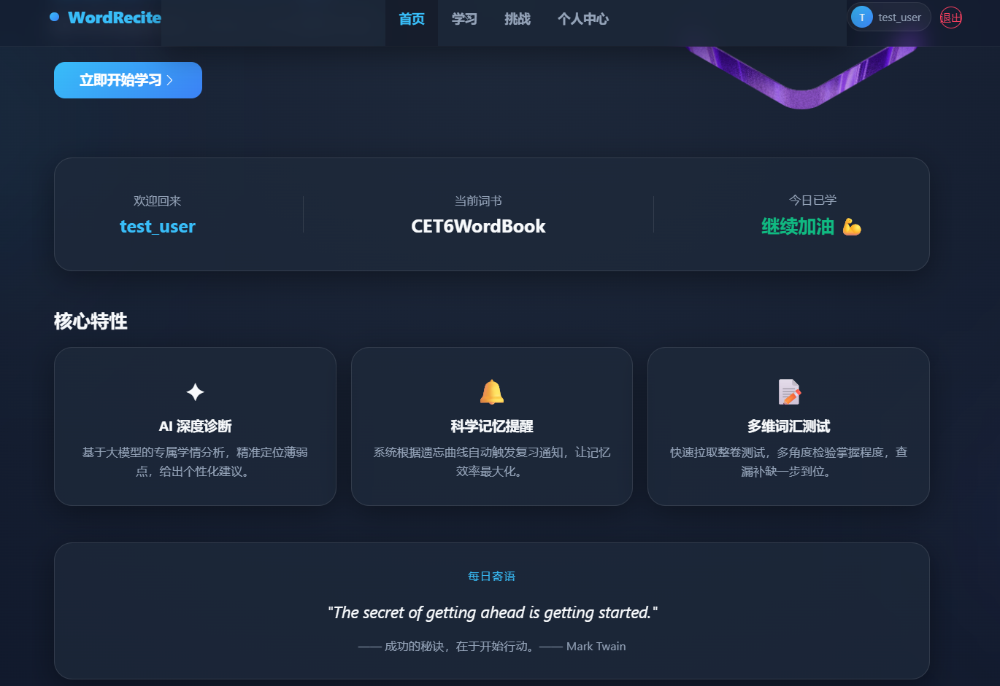

### 2. 选择单词书

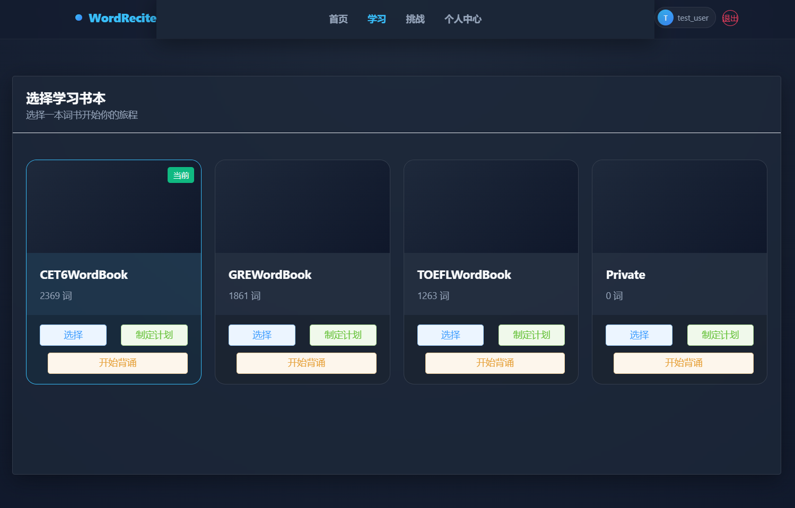

### 3. 单词背诵主界面

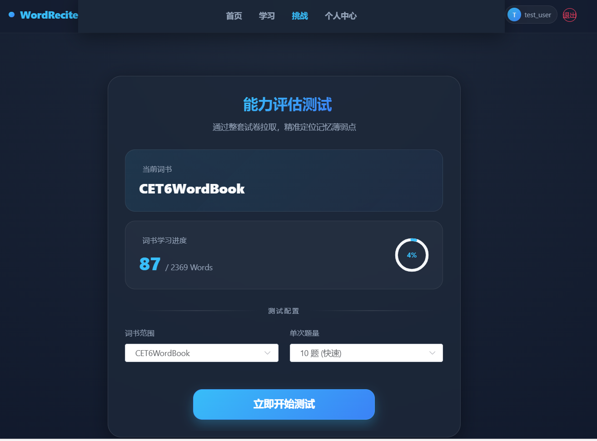

### 4. 单词卡片详情

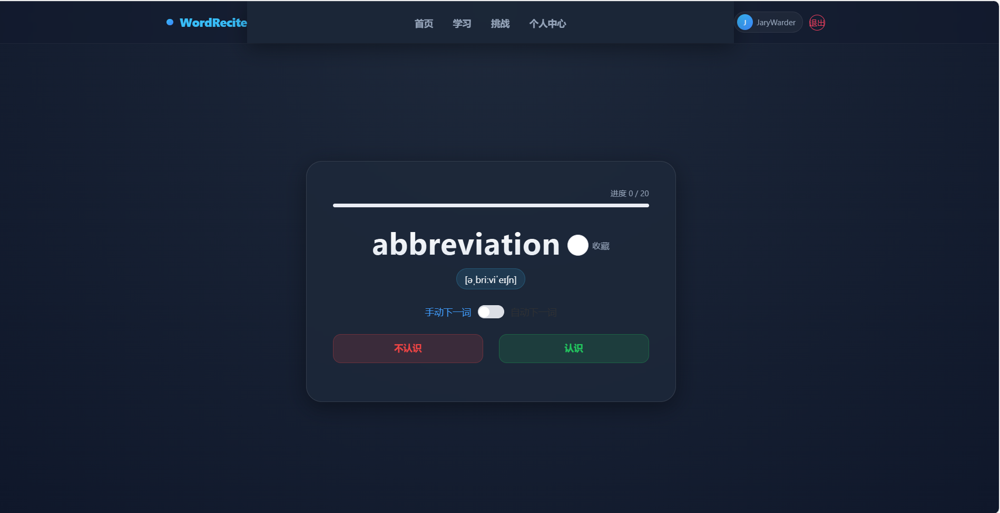

### 5. 每日足迹（学习模块）

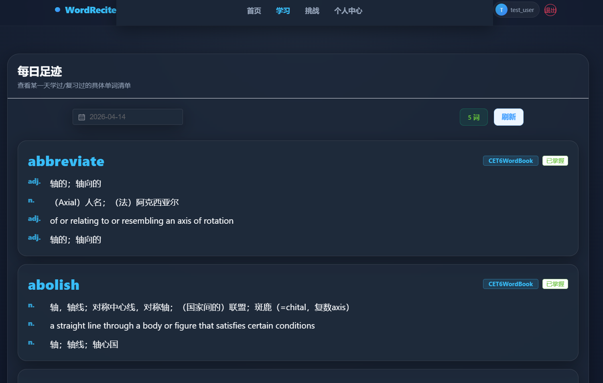

### 6. 进度分析 — AI 智能解读

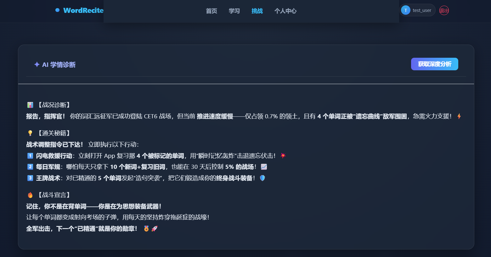


### 7. 进度分析 — 图表大屏

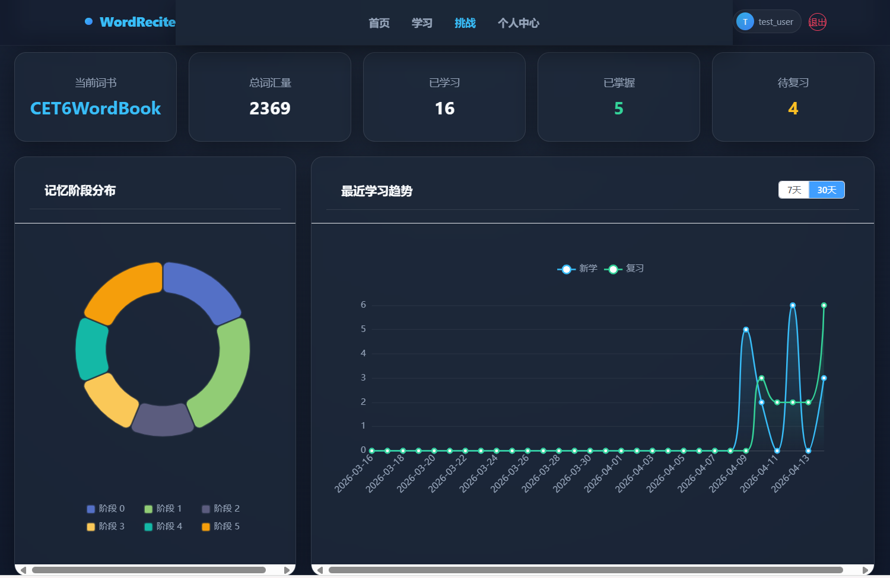


### 8. 生词本

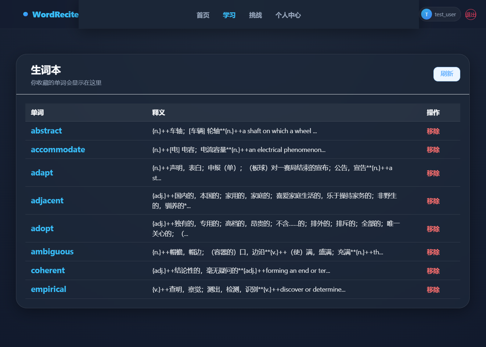

### 9. 个人中心

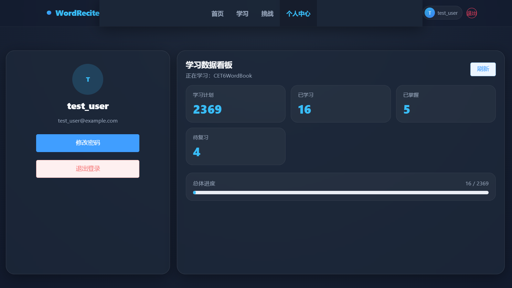

### 10. 邮件验证码（找回密码）

<div align="center">

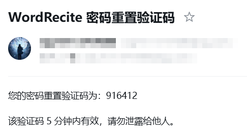 &nbsp;&nbsp; 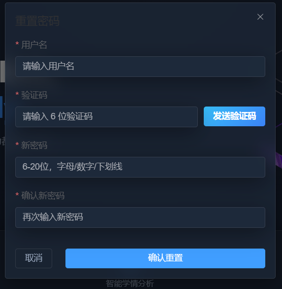

</div>

---

## 🛠️ 技术选型

### 前端

| 技术 | 版本 | 用途 |
|------|------|------|
| [Vue 3](https://vuejs.org/) | 3.5.32 | 核心框架（Composition API） |
| [Vite](https://vitejs.dev/) | 8.0.4 | 构建工具 |
| [Vue Router](https://router.vuejs.org/) | 4.6.4 | 客户端路由 |
| [Pinia](https://pinia.vuejs.org/) | 3.0.4 | 全局状态管理 |
| [Element Plus](https://element-plus.org/) | 2.13.7 | UI 组件库 |
| [ECharts](https://echarts.apache.org/) | 6.0.0 | 数据可视化图表 |
| [Axios](https://axios-http.com/) | 1.15.0 | HTTP 请求客户端 |
| [markdown-it](https://github.com/markdown-it/markdown-it) | 14.1.1 | 私密笔记 Markdown 渲染 |
| [node-forge](https://github.com/digitalbazaar/forge) | 1.4.0 | RSA 前端加密 |

### 后端

| 技术 | 版本 | 用途 |
|------|------|------|
| [Spring Boot](https://spring.io/projects/spring-boot) | 3.2.4 | 核心框架 |
| Java | 17 | 运行环境 |
| [MyBatis-Plus](https://baomidou.com/) | 3.5.5 | ORM 框架 |
| [JJWT](https://github.com/jwtk/jjwt) | 0.12.5 | JWT 认证 |
| [BouncyCastle](https://www.bouncycastle.org/) | 1.70 | RSA 后端加密 |
| [OkHttp3](https://square.github.io/okhttp/) | 4.12.0 | AI 服务 HTTP 调用 |
| [FastJSON2](https://github.com/alibaba/fastjson2) | 2.0.47 | JSON 序列化 |
| [Lombok](https://projectlombok.org/) | 1.18.38 | 代码简化 |
| Spring Mail | — | 邮件验证码服务 |

### 数据库

| 技术 | 用途 |
|------|------|
| MySQL 8.0 | 主数据库（`bs_project`） |


---

## 🚀 快速开始

### 环境依赖

在开始之前，请确保本地已安装以下环境：

| 依赖 | 版本要求 | 说明 |
|------|----------|------|
| JDK | 17+ | 后端运行环境 |
| Maven | 3.8+ | 后端依赖管理 |
| Node.js | 18+ | 前端运行环境 |
| MySQL | 8.0+ | 主数据库 |

---

### 1. 克隆项目（或直接解压）

```bash
git clone https://github.com/your-username/WordRecite.git
cd WordRecite
```

---

### 2. 导入测试数据（可选）

> 💡 **测试账号已预置**
>
> 项目提供了一套完整的演示数据，涵盖记忆曲线各阶段单词、近 7 天每日足迹、生词本收藏等，可直接用于全链路功能测试。
>
> ```
> 账号：test_user
> 密码：123456
> ```
>
> 执行以下命令导入测试数据（需先完成建表和词书导入）：
>
> ```bash
> mysql -u root -p bs_project < DB/test_data.sql
> ```

---

### 3. 数据库初始化（建表 + 词书）

```sql
-- 创建数据库
CREATE DATABASE bs_project CHARACTER SET utf8mb4 COLLATE utf8mb4_unicode_ci;
```

然后按顺序执行 `DB/` 目录下的 SQL 初始化脚本：

```bash
# 1. 建表结构（核心表）
mysql -u root -p bs_project < DB/create_new.sql
mysql -u root -p bs_project < DB/creat_wordList.sql
mysql -u root -p bs_project < DB/daily_new.sql
mysql -u root -p bs_project < DB/private_new.sql

# 2. 导入单词书数据（按需选择）
mysql -u root -p bs_project < DB/WordBooks.sql
mysql -u root -p bs_project < DB/CET6_patched_v2.sql   # 六级词汇
mysql -u root -p bs_project < DB/TOEFL_patched_v2.sql  # 托福词汇
mysql -u root -p bs_project < DB/GRE_patched_v2.sql    # GRE 词汇

# 3. 补丁与初始化（如有需要）
mysql -u root -p bs_project < DB/compete_init.sql
mysql -u root -p bs_project < DB/update_missing_tables.sql
```

> ⚠️ 如遇字符集问题，可先运行 `DB/patch_wordbooks_gbk_to_utf8.py` 进行编码修复。

---

### 4. 后端启动

**4.1 配置文件**

复制并修改本地配置文件：

```bash
cp Demo/src/main/resources/application-local.yml.example Demo/src/main/resources/application-local.yml
```

编辑 `application.yml`，填入你的本地配置：

```yaml
spring:
  datasource:
    url: jdbc:mysql://127.0.0.1:3306/bs_project?useUnicode=true&characterEncoding=utf8
    username: your_mysql_username      # 替换为你的 MySQL 用户名
    password: your_mysql_password      # 替换为你的 MySQL 密码

  mail:
    username: your_email@qq.com        # 替换为你的 QQ 邮箱
    password: your_smtp_auth_code      # 替换为 QQ 邮箱 SMTP 授权码

# AI 服务配置（可选）
ai:
  api-key: your_ai_api_key             # 替换为你的 AI 服务 API Key
  api-url: https://your-ai-api-url
```

**4.2 启动服务**

```bash
cd Demo
mvn spring-boot:run
```

后端服务默认运行在 `http://localhost:8080`

---

### 5. 前端启动

**5.1 安装依赖**

```bash
cd front-v3
npm install
# 或使用 pnpm（推荐）
pnpm install
```

**5.2 配置 API 地址**

检查并按需修改 `front-v3/src/api/http.js` 中的 `baseURL`，确保指向后端地址：

```js
// 默认为本地后端
baseURL: 'http://localhost:8080'
```

**5.3 启动开发服务器**

```bash
npm run dev
```

前端默认运行在 `http://localhost:5173`

**5.4 生产构建**

```bash
npm run build
```

构建产物输出至 `front-v3/dist/`

---

## 📁 目录结构

```
WordRecite/
├── front-v3/                        # Vue 3 前端项目
│   ├── src/
│   │   ├── api/                     # 按模块划分的 Axios 请求封装（13个模块）
│   │   ├── components/
│   │   │   └── small/               # 登录、注册、重置密码等弹窗组件
│   │   ├── views/                   # 页面级组件（首页、学习、测试、进度等）
│   │   ├── stores/                  # Pinia 全局状态（用户信息）
│   │   ├── router/                  # Vue Router 路由配置
│   │   ├── utils/                   # 工具函数
│   │   └── assets/                  # 静态资源
│   ├── index.html
│   ├── vite.config.js
│   └── package.json
│
├── Demo/                            # Spring Boot 后端项目
│   └── src/main/
│       ├── java/example/
│       │   ├── controller/          # REST 控制层（18个接口类）
│       │   ├── service/             # 业务逻辑层（用户、AI、测试、进度分析）
│       │   ├── dao/                 # MyBatis-Plus Mapper 接口（7个）
│       │   ├── pojo/                # 数据库实体类（7个）
│       │   ├── dto/                 # 数据传输对象
│       │   ├── config/              # CORS 跨域 & JWT 拦截器配置
│       │   ├── utils/               # JWT 工具类
│       │   └── common/              # 统一响应封装
│       └── resources/
│           ├── application.yml      # 主配置文件
│           ├── application-local.yml # 本地敏感配置（不提交 Git）
│           └── db/                  # 数据库相关资源
│
├── DB/                              # 数据库初始化 SQL 脚本
├── docs/                            # 项目文档与截图
└── README.md
```

---

## 📄 许可证

本项目基于 [MIT License](LICENSE) 开源。

```
MIT License

Copyright (c) 2026 WordRecite Contributors

Permission is hereby granted, free of charge, to any person obtaining a copy
of this software and associated documentation files (the "Software"), to deal
in the Software without restriction, including without limitation the rights
to use, copy, modify, merge, publish, distribute, sublicense, and/or sell
copies of the Software, and to permit persons to whom the Software is
furnished to do so, subject to the following conditions:

The above copyright notice and this permission notice shall be included in all
copies or substantial portions of the Software.
```

---

<div align="center">

Made by JaryWarder

</div>
